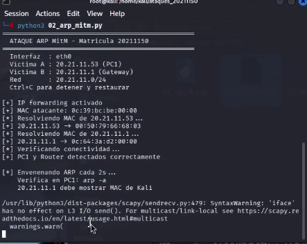
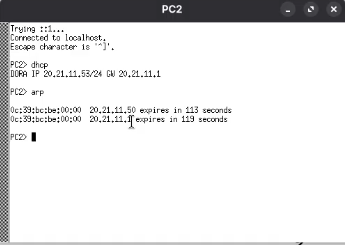
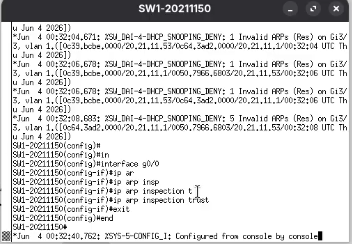
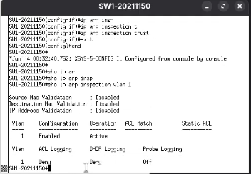
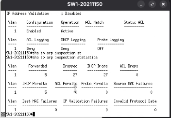

# ARP-MitM-20211150
# Ataque ARP Man-in-the-Middle — Matrícula 20211150
**Autor:** Alvaro Smilk Baez Tavera
**Matrícula:** 20211150
**Fecha:** 3 Junio 2026

---

## Descripción
Script que realiza un ataque Man-in-the-Middle (MitM) 
mediante envenenamiento de caché ARP. Intercepta el 
tráfico entre el PC víctima y el gateway posicionando 
a Kali Linux como intermediario invisible.

---

## Objetivo
Demostrar la vulnerabilidad del protocolo ARP ante 
ataques de spoofing, interceptando comunicaciones entre 
dos hosts y aplicando las contramedidas necesarias.

---

## Topología
Router-20211150 (20.21.11.1)
|
SW1-20211150 (20.21.11.2)
/        
Kali Linux    PC1/PC2/PC3
(20.21.11.50) (Víctimas)
ATACANTE

## Direccionamiento
| Dispositivo | IP          | Interfaz | Rol      |
|-------------|-------------|----------|----------|
| Router      | 20.21.11.1  | gi0/0    | Gateway  |
| SW1         | 20.21.11.2  | gi0/0    | Switch   |
| Kali Linux  | 20.21.11.50 | gi3/3    | Atacante |
| PC1         | DHCP        | gi0/1    | Víctima  |
| PC2         | DHCP        | gi0/2    | Víctima  |
| PC3         | DHCP        | gi0/3    | Víctima  |

---

## Requisitos
- Python 3
- Scapy instalado
- Privilegios root
- IP forwarding activado
- Conectividad entre Kali y las víctimas

### Instalación
```bash
pip3 install scapy --break-system-packages

# Activar IP forwarding:
echo 1 > /proc/sys/net/ipv4/ip_forward
```

---

## Parámetros del script
| Parámetro  | Valor        | Descripción                       |
|------------|--------------|-----------------------------------|
| INTERFAZ   | eth0         | Interfaz de red del atacante      |
| VICTIMA_A  | 20.21.11.100 | IP del PC víctima                 |
| VICTIMA_B  | 20.21.11.1   | IP del Gateway                    |
| INTERVALO  | 2            | Segundos entre ARP replies        |

---

## Uso
```bash
# Básico:
sudo python3 02_arp_mitm.py

# Con argumentos:
sudo python3 02_arp_mitm.py [IP_VictimaA] [IP_VictimaB] [interfaz]

# Ejemplo:
sudo python3 02_arp_mitm.py 20.21.11.100 20.21.11.1 eth0
```

---

## Funcionamiento
1. Activa IP forwarding para reenviar tráfico
2. Resuelve la MAC real de ambas víctimas via ARP
3. Cada 2 segundos envía ARP replies falsos:
   - A PC víctima: Gateway está en MAC de Kali
   - Al Gateway: PC víctima está en MAC de Kali
4. Todo el tráfico entre ambos pasa por Kali
5. Kali captura y reenvía el tráfico (invisible)
6. Al detener con Ctrl+C restaura ARP original

---

## Verificación del ataque
```bash
# En PC víctima — ver tabla ARP envenenada:
arp -n
# 20.21.11.1 debe mostrar MAC de Kali

# En Kali — capturar tráfico interceptado:
sudo tcpdump -i eth0 -n

# En Kali — ver tráfico HTTP:
sudo tcpdump -i eth0 port 80 -A
```

---

## Capturas

### Script corriendo en Kali


### ARP envenenado en la víctima



---

## Contramedida
```bash
# En SW1 — Dynamic ARP Inspection:
SW1(config)# ip arp inspection vlan 1
SW1(config)# interface gi0/0
SW1(config-if)# ip arp inspection trust
SW1(config-if)# exit

# Verificar:
SW1# show ip arp inspection vlan 1
SW1# show ip arp inspection statistics
```

### Contramedida




---

## Video
[Ver demostración en YouTube](https://youtu.be/w-qJVHRhWlI?si=k1N074F4NMrKSByt)

---

## Referencias
- CVE-1999-0667: ARP Spoofing
- RFC 826: ARP Protocol
- Herramienta: Python 3 + Scapy
